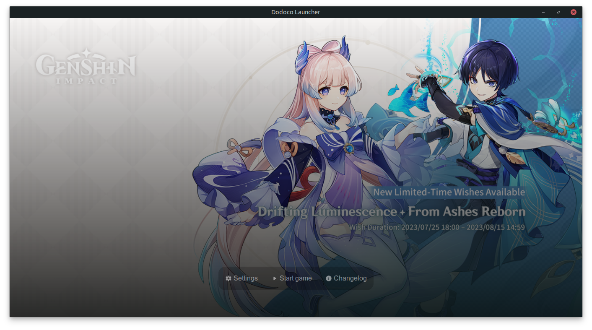
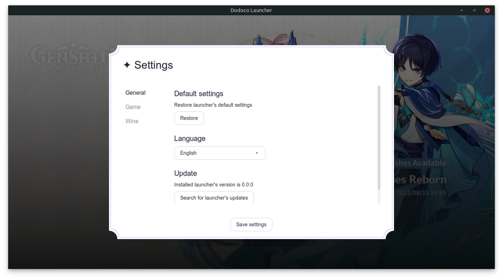
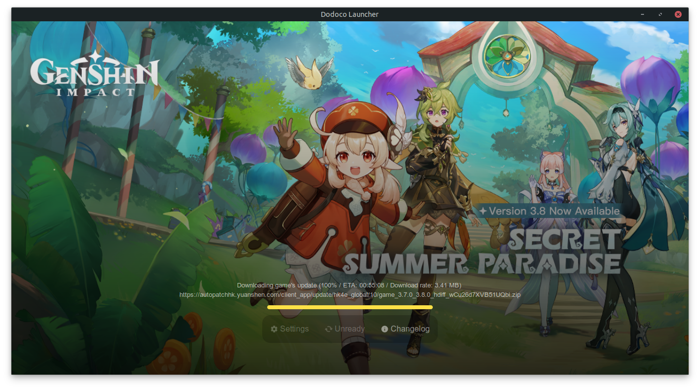

# Dodoco Launcher

<br>
<div align="center">
    <span><strong>🇬🇧 English</strong></span>
    <span>・</span>
    <a href="README_pt.md">🇵🇹 Português</a>
</div>
<br>

A work in progress (WIP) unofficial Genshin Impact launcher written in C#, TypeScript and Svelte, enabling the game be played from Linux-based operating systems, inspired by [An Anime Game Launcher](https://github.com/an-anime-team/an-anime-game-launcher) project. Currently it supports game's download, update and repair through official APIs, alongside Wine's download. DXVK management is upcoming feature, although you can install it manually.

Please keep in mind that this project is experimental and that the source code may change abruptly or even seem to make no sense.

<div align="center">
    
    <div align="center">
      
      
    </div>
</div>

## Download

### Install

Latest launcher's version can be downloaded [here](https://github.com/BrendoCosta/dodoco-launcher/releases/latest). Unzip the file `dodoco-launcher-vX.X.X.zip` to a directory of your choice.

### Run

Run the executable file `dodoco-launcher` through your file explorer or the terminal:

```sh
chmod +x ./dodoco-launcher
```

```sh
./dodoco-launcher
```

## Build

### Requirements

- .NET SDK 7.0
- CMake 3.26
- Mingw-w64 8.0.0
- Node.js 18.16.0

**Important:** The build scripts expect all the paths to the executables of the above tools to be correctly configured in the PATH variable.

**Important:** You must reserve at least 1 GB of storage space to build the project.

### Clone

Clone this project's repository with `--recurse-submodules` flag:

```sh
git clone --recurse-submodules https://github.com/BrendoCosta/dodoco-launcher.git
```

Enter project's directory:

```sh
cd ./dodoco-launcher
```

### Run

Run the launcher directly from the source code:

```sh
dotnet run
```

### Release

Creates a release build of the project to `/bin/Release/net7.0/linux-x64/publish/` directory:

```sh
dotnet publish
```

## License

Source code avaliable under [MIT](/LICENSE) license.